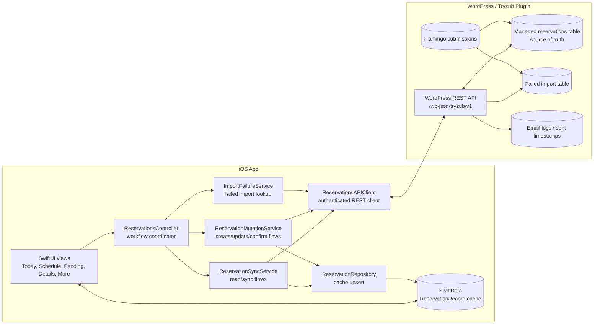
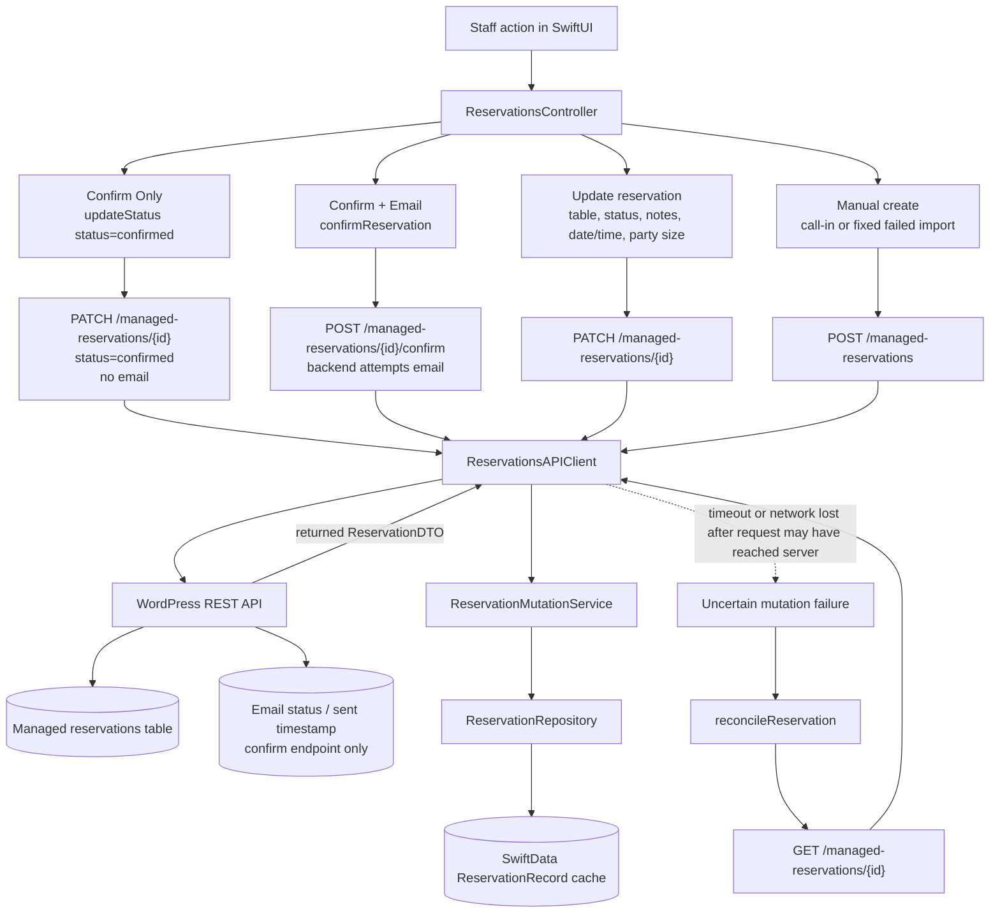
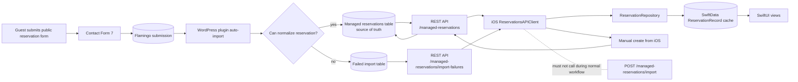

# Tryzub Reservations Architecture Diagrams

These diagrams describe the one-restaurant MVP architecture. The WordPress plugin REST API is the source of truth. SwiftData is a local cache. The iOS app must not call `POST /managed-reservations/import` during normal workflow.

## 1. High-Level Architecture

Notes:
- The controller is the app's practical traffic cop. Views call controller workflow methods; they should not create API clients directly.
- Services are thin. They mostly make the controller easier to reason about by splitting reads, mutations, and failed import lookups.
- SwiftData is cache only. The backend managed reservations table remains truth.

## 2. Fetch / Sync Flow

Notes:
- Today fetches one page for the current date.
- Schedule fetches the configured date window, paged.
- Pending/review fetches `new` and `needs_review` queues.
- A failed network fetch should leave cached rows visible.

## 3. Mutation Flow

Notes:
- Confirm Only is a status PATCH and must not send email.
- Confirm + Email is the only normal iOS path that should hit `/managed-reservations/{id}/confirm`.
- The app should not locally fake mutation success. Returned server DTOs are upserted into SwiftData.
- Reconcile is for ambiguous network failures where the server may have applied the mutation.

## 4. App Lifecycle / Screen Triggers

```mermaid
flowchart TD
    Launch["App launch"] --> Creds["AppCredentialStore<br/>environment or Keychain credentials"]
    Creds --> HasCreds{"Credentials present?"}
    HasCreds -- "no" --> Setup["CredentialsSetupView"]
    HasCreds -- "yes" --> Env["Create AppEnvironment<br/>API client + role + capabilities"]
    Env --> Root["ReservationsListView"]
    Root --> Controller["Create ReservationsController<br/>inject as environmentObject"]
    Root --> InitialTask[".task loadIfNeeded"]
    InitialTask --> InitialFetch["Startup Today fetch"]

    Root --> Today["Today tab"]
    Today --> ManualRefresh["Pull refresh / toolbar refresh"]
    ManualRefresh --> TodayFetch["requestManualTodayRefresh<br/>GET today reservations"]
    Today --> AutoLoop["HostBoardView auto-refresh loop<br/>while visible and app active"]
    AutoLoop --> AutoGuards{"Allowed?<br/>not busy, no interaction,<br/>cooldown passed"}
    AutoGuards -- "yes" --> AutoFetch["autoRefreshDashboardIfAllowed<br/>GET today reservations"]
    AutoGuards -- "no" --> Skip["skip and keep cached view"]

    Root --> Schedule["Schedule tab"]
    Schedule --> ScheduleActive["scheduleBecameActive"]
    ScheduleActive --> ScheduleFresh{"Schedule scope fresh?"}
    ScheduleFresh -- "yes" --> ScheduleCache["Use SwiftData cache"]
    ScheduleFresh -- "no" --> ScheduleFetch["GET /managed-reservations?from=&to="]

    Root --> Pending["Pending / Review tab"]
    Pending --> PendingActive["reviewBecameActive"]
    PendingActive --> PendingFresh{"Review scope fresh?"}
    PendingFresh -- "yes" --> PendingCache["Use SwiftData cache"]
    PendingFresh -- "no" --> PendingFetch["GET status=needs_review<br/>GET status=new"]
```

Notes:
- The initial app task loads Today once through a controller guard.
- Manual refreshes are staff-visible and post success/failure notices.
- Auto-refresh is deliberately guarded so it does not fight active staff interactions.
- Schedule and Pending use freshness checks before fetching.

## 5. Backend Data Flow

Notes:
- Public form data enters through Contact Form 7 and Flamingo before plugin import logic.
- Good submissions become managed reservations. Bad submissions become failed import records for manager/developer repair.
- iOS reads failed imports and may create a fixed manual reservation, but it should not trigger the backend import endpoint.
- This is enough for the restaurant MVP; do not add SaaS ingestion architecture before service actually needs it.
