# Tryzub Reservations — Architecture Diagrams

**Source of truth:** WordPress REST API at `https://tryzubchicago.com/wp-json/tryzub/v1`  
**Local cache:** SwiftData `ReservationRecord` only — never authoritative  
**Hard rule:** iOS must **not** call `POST /managed-reservations/import` during normal workflow (not implemented in client; diagnostics tracks accidental use)

**Production note:** `Tryzub_ReservationsApp` hardcodes `role: .developer` today. Capability tables below reflect the role model; pilot builds should switch to `.staff` or `.manager` before boss testing.

---

## 1. High-level architecture

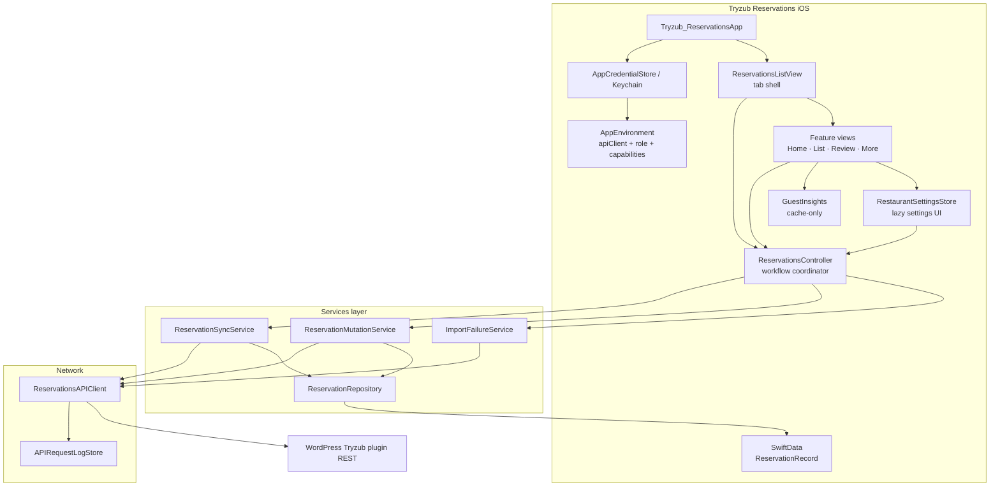

**What matters**
- One shared `ReservationsAPIClient` per session; repositories/services are created per `ModelContext` operation.
- Views call **controller workflow methods** for reservations; settings screens mostly use `RestaurantSettingsStore` → controller.
- **Exception:** `HostBoardView` calls `environment.apiClient` directly for today availability/slots/blocked summary (lazy, 120s cache) — not through controller.
- `ReservationsController.operationState` mirrors refresh, mutation, reconcile, create, import-count, and offline state for granular UI/diagnostics without changing existing workflow methods.
- Guest Insights never touches network or SwiftData writes.

---

## 2. Startup & dependency graph

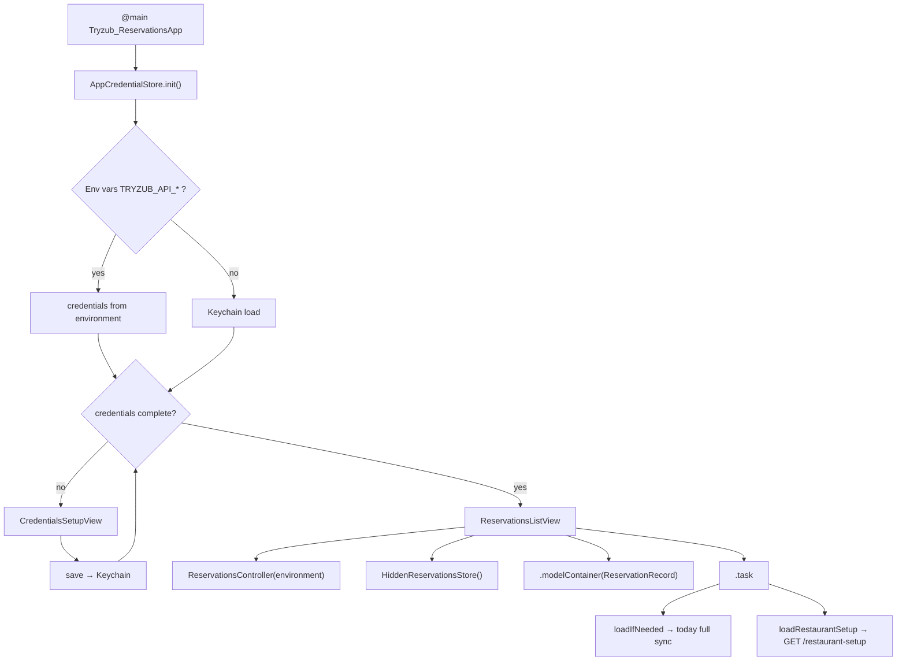

**What matters**
- Credentials: env vars override Keychain on launch (simulator/dev); device uses Keychain after first save.
- SwiftData container is scene-level; all tabs share one cache.
- Startup network: today reservations (full replace) + restaurant setup (in-memory `@Published` on controller).
- No reservation fetch happens before credentials gate passes.

---

## 3. Tab shell & view ownership

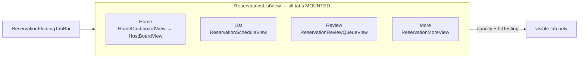

| Tab | Root view | `isActive` gating | Primary data source |
| --- | --- | --- | --- |
| Home | `HomeDashboardView` → `HostBoardView` | Yes — auto-refresh, clock, availability | `@Query` + today sync |
| List | `ReservationScheduleView` | Yes — activation fetch | `@Query` + schedule window |
| Review | `ReservationReviewQueueView` | Yes — activation fetch | `@Query` + review queues |
| More | `ReservationMoreView` | No | Navigation pushes only |

**What matters**
- Tabs stay in the tree (opacity/zIndex) to avoid NavigationStack + `@Query` rebuild lag.
- Inactive tabs do not run auto-refresh loops (`isActive` guards `.task` loops).
- More sub-screens fetch **only when navigated to** (settings, hidden, cancelled, diagnostics).

---

## 4. Fetch / sync lifecycle

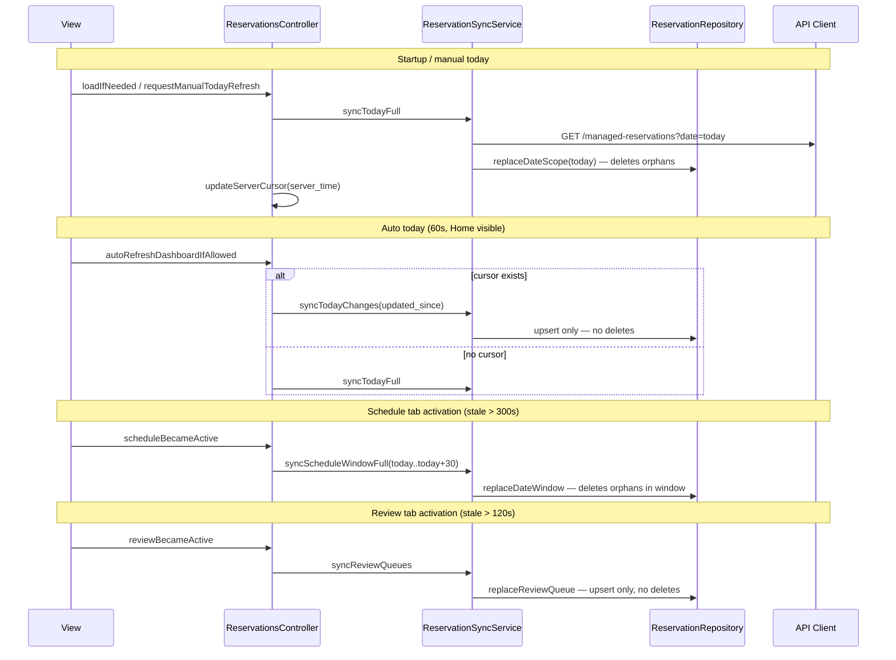

### Sync strategy summary

| Scope | Trigger | Endpoint | Write mode | Deletes local orphans? | Cursor (`server_time`) |
| --- | --- | --- | --- | --- | --- |
| Today startup/manual | `loadIfNeeded`, pull-refresh | `GET ?date=today` | `replaceDateScope` | **Yes** (non-hidden) | Stored |
| Today auto | Home loop 60s | `GET ?date=today&updated_since=` | `upsert` | **No** | Stored |
| Schedule window | Tab active / refresh | `GET ?from&to` paged | `replaceDateWindow` | **Yes** in window | Stored |
| Review queues | Tab active / refresh | `GET ?status=needs_review` + `new` | `replaceReviewQueue` | **No** | None |
| Schedule All pages | Search / load more | `GET` paginated | `upsert` | **No** | None |
| Cancelled | More screen open | `GET ?status=cancelled` | `upsert` | **No** | None |
| Hidden archive | Hidden screen open | `GET ?include_hidden=1` | `upsert` | **No** | None |
| Import failure count | Admin/dev screen or explicit diagnostics | `GET /import-failures?per_page=1` | None | — | None |

**What matters**
- `server_time` cursor is **in-memory on controller only** — not persisted across app kill.
- Delta sync (`updated_since`) is **today auto-refresh only**; manual/startup always full-replace today.
- Empty delta response: upsert skipped; no deletes.
- Network failure: offline notice (60s cooldown); cache remains visible; scope failure cooldown applies (today manual 8s, auto failure 180s).

---

## 5. Mutation lifecycle

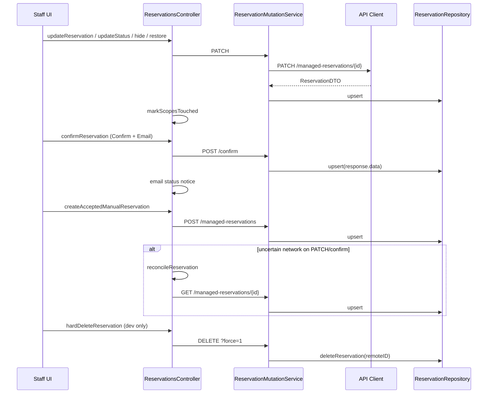

### Mutation rules

| Action | Endpoint | Email | Cache update |
| --- | --- | --- | --- |
| Confirm Only | PATCH `status=confirmed` | No | Upsert after success |
| Confirm + Email | POST `/{id}/confirm` | Backend sends/records | Upsert after success |
| Manual create | POST `/managed-reservations` | No | Upsert after success |
| Edit fields | PATCH | No | Upsert after success |
| Seat / cancel / complete / no-show | PATCH `status` | No | Upsert after success |
| Hide wrong entry | PATCH `is_hidden=true` | No | Upsert after success |
| Restore hidden | PATCH `is_hidden=false` | No | Upsert after success |
| Hard delete | DELETE `?force=1` | No | Local delete after success |
| Guest manage link | POST `/{id}/guest-manage-link` | **No** — copy link or local Gmail/Mail draft | None |

**Reconcile:** `updateReservation` and `confirmReservation` call `reconcileReservation` when `error.mayHaveReachedReservationServer` (timeout, connection lost, bad response).

### Operation / progress state

`ReservationsController` still exposes legacy flags (`isSyncing`, `isAutoRefreshing`, `actionInProgressIDs`, `isCreatingReservation`) and now also publishes a consolidated `ReservationOperationState` snapshot.

| State | Owner | UI intent |
| --- | --- | --- |
| Startup / manual / screen-active refresh | `activeSyncIntents` by `ReservationSyncScope` | Header/toolbar progress; keep cached rows visible |
| Quiet auto-refresh | `isAutoRefreshing` + `.automatic` sync intent | No blocking modal |
| Per-row mutation | `mutatingReservationIDs` | Disable/spinner only for affected row/action |
| Uncertain mutation reconcile | `reconcilingReservationIDs` | Keep affected row busy while server truth is checked |
| Manual create | `isCreatingReservation` | Saving state inside create form |
| Admin/import count | `isCheckingImportFailureCount` | Developer/admin progress only |
| Offline/network unavailable | `lastNetworkUnavailableAt` | Non-blocking saved-data notice |

---

## 6. Role & capability gating

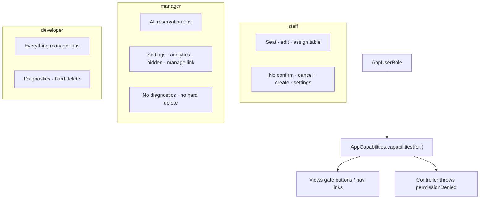

| Capability | Staff | Manager | Developer |
| --- | :---: | :---: | :---: |
| `canSeatReservations` | ✓ | ✓ | ✓ |
| `canEditReservationDetails` | ✓ | ✓ | ✓ |
| `canConfirmReservations` | ✗ | ✓ | ✓ |
| `canCancelReservations` | ✗ | ✓ | ✓ |
| `canCreateManualReservations` | ✗ | ✓ | ✓ |
| `canGenerateGuestManageLinks` | ✗ | ✓ | ✓ |
| `canViewHiddenReservations` | ✗ | ✓ | ✓ |
| `canManageRestaurantSettings` | ✗ | ✓ | ✓ |
| `canViewAnalytics` | ✗ | ✓ | ✓ |
| `canViewFailedImports` | ✗ | ✓ | ✓ |
| `canViewDeveloperDiagnostics` | ✗ | ✗ | ✓ |
| `canHardDeleteReservations` | ✗ | ✗ | ✓ |

**UI quirk (verify before pilot):** Failed Imports nav link requires **both** `canViewFailedImports` **and** `canViewDeveloperDiagnostics` — managers cannot reach it in UI despite having import capability.

---

## 7. Restaurant operations / settings flow

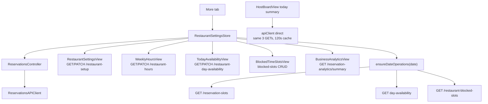

**What matters**
- Settings loads are **lazy** — do not block Home/List/Review tab switches.
- `ensureDateOperations` owns Task lifecycle (prevents stuck spinners on date change).
- `GET /reservation-slots` is **public** (no auth).
- Home availability indicator uses direct API client, not `RestaurantSettingsStore`.

---

## 8. Admin / diagnostics flow

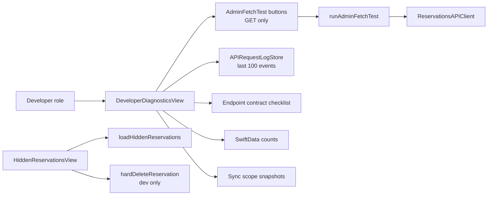

**Danger zone:** Diagnostics intentionally has **no automated mutation tests**. Confirm, cancel, create, block slots, and import must go through normal staff UI.

---

## 9. Guest manage link & email direction

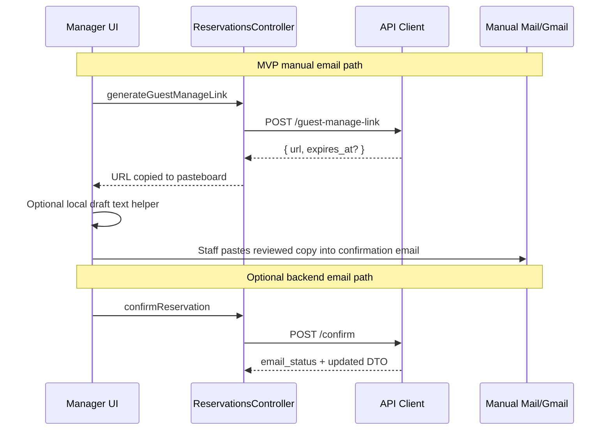

**Current direction (from code comments)**
- **Primary MVP for call-ins / no-auto-email:** Confirm Only (PATCH) + generate manage link + copy local draft + manual Mail/Gmail.
- **Confirm + Email:** POST `/confirm` — backend sends/attempts email; UI shows `emailStatus` notices.
- Manual create: always confirmed, **no email**.
- Guest manage link and local draft generation do **not** set `confirmationEmailSentAt`.

---

## 10. SwiftData cache flow

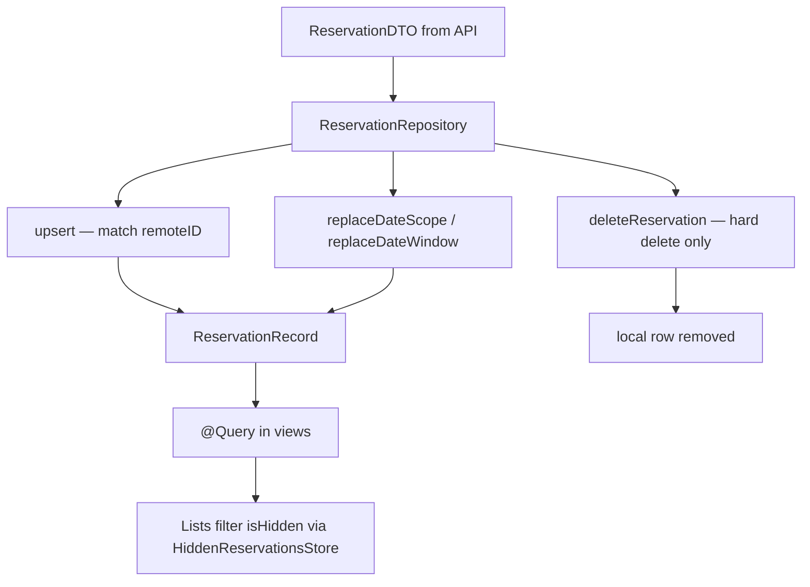

**Visibility rules**
- Normal lists exclude `isHidden == true` via `HiddenReservationsStore.isHidden`.
- Hidden rows preserved during replace sync when `includeHidden: false` (default).
- Review queue sync never deletes rows that left `new`/`needs_review` locally.

---

## 11. Backend integration map

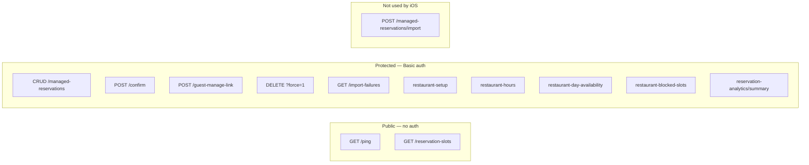

**API client defaults:** 30s request timeout, 60s resource timeout, GET retries ≥1 on timeout/connection lost, mutations no retry by default.

---

## Known weak spots (document, do not fix in this pass)

| Area | Issue |
| --- | --- |
| Role | Production hardcoded `.developer` — pilot needs explicit role selection |
| Failed Imports | Manager capability exists but UI requires developer |
| HostBoard availability | Direct `apiClient` bypasses controller |
| Guest Insights | Quality limited to cached history — no guest API |
| Cursors | Lost on app restart — first auto-refresh may full-replace |
| `createReservation` controller method | Exists but UI uses `createAcceptedManualReservation` only |
| Mutation progress | `actionInProgressIDs` disables buttons; verify in code if any view blocks entire screen |
