# Tryzub Reservations — Architecture Diagrams

**Source of truth:** WordPress REST API at `https://tryzubchicago.com/wp-json/tryzub/v1`  
**Local cache:** SwiftData `ReservationRecord` only — never authoritative  
**Hard rule:** iOS must **not** call `POST /managed-reservations/import` during normal workflow (not implemented in client; diagnostics tracks accidental use)

**Role note:** `Tryzub_ReservationsApp` uses `AppRoleStore` and `RoleSelectionView`. The selectable pilot roles are `.manager` and `.developer`; `.staff` still exists in the capability model but is not currently offered in the role picker.

---

## 1. High-level architecture

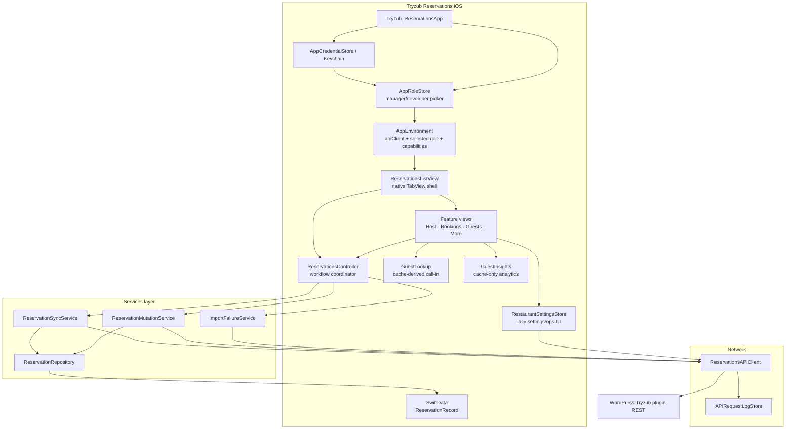

**What matters**
- One shared `ReservationsAPIClient` per selected-role session; repositories/services are created per `ModelContext` operation.
- Views call **controller workflow methods** for reservations; settings screens use `RestaurantSettingsStore` with the shared API client.
- Home availability/slots/blocked summary is controller-owned and date-keyed (`ensureAvailabilitySummary`, `cachedReservationSlots`, `cachedRestaurantBlockedSlots`) so Add/Edit can reuse cached slot data.
- `ReservationsController.operationState` mirrors refresh, mutation, reconcile, create, import-count, and offline state for granular UI/diagnostics without changing existing workflow methods.
- Guest Lookup never touches network while searching; it derives call-in matches from cached `ReservationRecord` rows and hands a `ManualReservationPrefill` to the manual create form.
- Guest Insights never touches network or SwiftData writes.

---

## 2. Startup & dependency graph

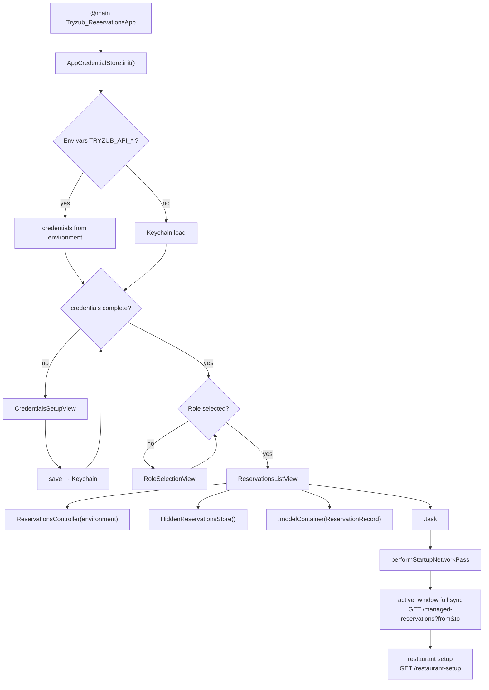

**What matters**
- Credentials: env vars override Keychain on launch (simulator/dev); device uses Keychain after first save.
- Role: manager/developer selection is persisted in `UserDefaults`; changing role recreates `ReservationsListView` with a new `AppEnvironment`.
- SwiftData container is scene-level; all tabs share one cache.
- Startup network: active reservation window (full replace) + restaurant setup (in-memory `@Published` on controller), launched behind a splash overlay without blocking cached SwiftData rendering.
- No reservation fetch happens before credentials gate passes.

---

## 3. Tab shell & view ownership

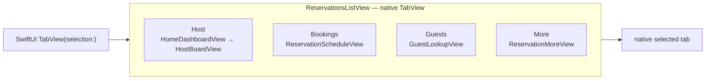

| Tab | Root view | `isActive` gating | Primary data source |
| --- | --- | --- | --- |
| Host | `HomeDashboardView` → `HostBoardView` | Yes — auto-refresh, clock, availability | active-window `@Query` filtered to selected date |
| Bookings | `ReservationScheduleView` | Yes — activation ensure-fresh | active-window `@Query`; Upcoming/Needs Review/Cancelled are cache filters; All mode paged on demand |
| Guests | `GuestLookupView` | Yes — search/debounce only while active | non-hidden cached reservations grouped into lightweight guest profiles |
| More | `ReservationMoreView` | No | Navigation pushes only |

**What matters**
- Native `TabView` owns tab safe areas, selection, and iPad tab behavior.
- Review is a Bookings filter, not a top-level tab.
- Inactive tabs do not run auto-refresh loops (`isActive` guards `.task` loops).
- Guests search is cache-only and does not call Guest Insights / Regular Guests clustering.
- More sub-screens fetch **only when navigated to** (settings, hidden, cancelled, diagnostics).

---

## 4. Fetch / sync lifecycle

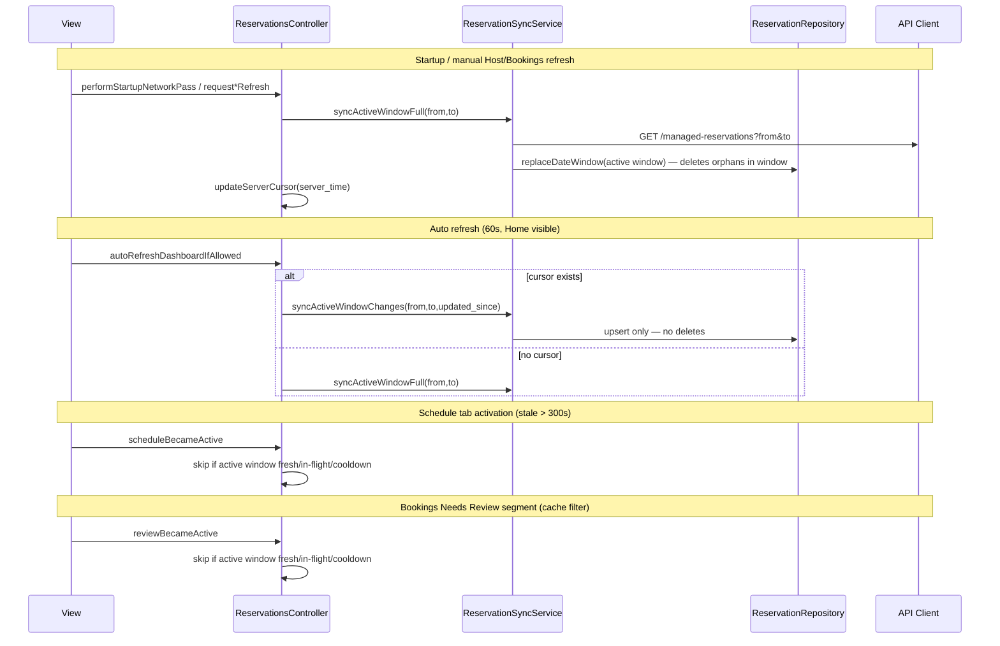

### Sync strategy summary

| Scope | Trigger | Endpoint | Write mode | Deletes local orphans? | Cursor (`server_time`) |
| --- | --- | --- | --- | --- | --- |
| Active window full | Startup; manual Host/Bookings refresh; stale activation | `GET ?from&to` paged | `replaceDateWindow` | **Yes** in window | Stored |
| Active window delta | Home quiet auto-refresh after cursor | `GET ?from&to&updated_since=` paged | `upsert` | **No** | Stored |
| Schedule upcoming | Tab active / refresh | Shared active window | cache-first | No separate fetch | Shared |
| Bookings Needs Review | Segment selection | Shared active window | cache-first | No separate fetch | Shared |
| Schedule All pages | Search / load more | `GET` paginated | `upsert` | **No** | None |
| Cancelled | More screen open | `GET ?status=cancelled` | `upsert` | **No** | None |
| Hidden archive | Hidden screen open | `GET ?include_hidden=1` | `upsert` | **No** | None |
| Import failure count/list | More Failed Imports sheet or explicit diagnostics | `GET /managed-reservations/import-failures` | None | — | None |

**What matters**
- `server_time` cursor is **in-memory on controller only** — not persisted across app kill.
- Delta sync (`updated_since`) is active-window auto-refresh only and always includes `from` and `to`.
- Empty delta response: upsert skipped; no deletes.
- Network failure: offline notice (60s cooldown); cache remains visible; scope failure cooldown applies (today manual 8s, auto failure 180s).

---

## 5. Mutation lifecycle

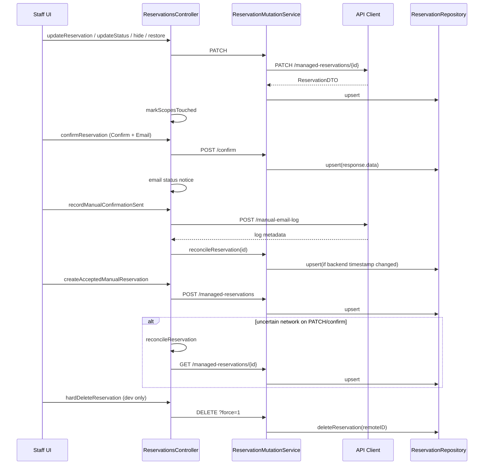

### Mutation rules

| Action | Endpoint | Email | Cache update |
| --- | --- | --- | --- |
| Confirm Only | PATCH `status=confirmed` | No | Upsert after success |
| Confirm + Email | POST `/{id}/confirm` | Backend/provider sends/records; disabled in MVP UI | Upsert after success |
| Manual email log | POST `/{id}/manual-email-log` | Records `draft_created`, `manual_sent`, or `manual_failed`; does **not** send email or change status | `manual_sent` reconciles by ID |
| Manual create | POST `/managed-reservations` | No | Upsert after success |
| Edit fields | PATCH | No | Upsert after success |
| Seat / cancel / complete / no-show | PATCH `status` | No | Upsert after success |
| Hide wrong entry | PATCH `is_hidden=true` | No | Upsert after success |
| Restore hidden | PATCH `is_hidden=false` | No | Upsert after success |
| Hard delete | DELETE `?force=1` | No | Local delete after success |
| Guest manage link | POST `/{id}/guest-manage-link` | **No** — copy link or local Gmail/Mail draft | None |

**Reconcile:** `updateReservation` and `confirmReservation` call `reconcileReservation` when `error.mayHaveReachedReservationServer` (timeout, connection lost, bad response).

### Operation / progress state

`ReservationsController` still exposes legacy flags (`isSyncing`, `isAutoRefreshing`, `actionInProgressIDs`, `isCreatingReservation`) and now also publishes a consolidated `ReservationOperationState` snapshot.

| State | Owner | UI intent |
| --- | --- | --- |
| Startup / manual / screen-active refresh | `activeSyncIntents` by `ReservationSyncScope` | Header/toolbar progress; keep cached rows visible |
| Quiet auto-refresh | `isAutoRefreshing` + `.automatic` sync intent | No blocking modal |
| Per-row mutation | `mutatingReservationIDs` | Disable/spinner only for affected row/action |
| Uncertain mutation reconcile | `reconcilingReservationIDs` | Keep affected row busy while server truth is checked |
| Manual create | `isCreatingReservation` | Saving state inside create form |
| Admin/import count | `isCheckingImportFailureCount` | Developer/admin progress only |
| Offline/network unavailable | `lastNetworkUnavailableAt` | Non-blocking saved-data notice |

---

## 6. Role & capability gating

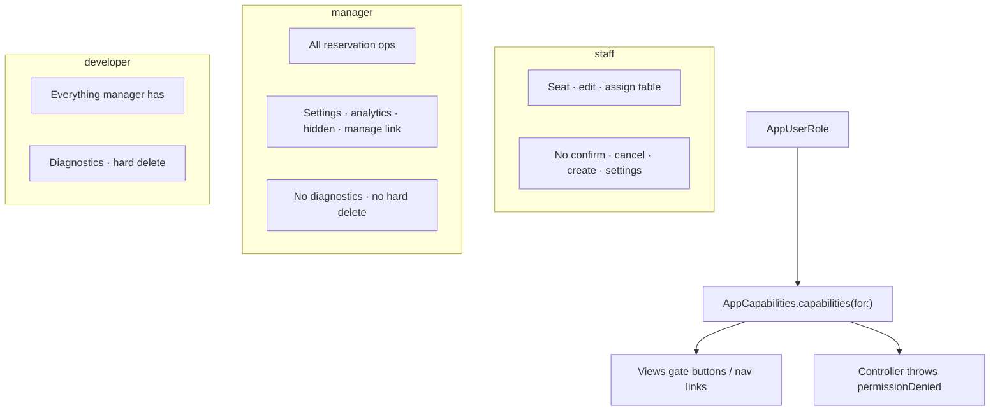

| Capability | Staff | Manager | Developer |
| --- | :---: | :---: | :---: |
| `canSeatReservations` | ✓ | ✓ | ✓ |
| `canEditReservationDetails` | ✓ | ✓ | ✓ |
| `canConfirmReservations` | ✗ | ✓ | ✓ |
| `canCancelReservations` | ✗ | ✓ | ✓ |
| `canCreateManualReservations` | ✗ | ✓ | ✓ |
| `canGenerateGuestManageLinks` | ✗ | ✓ | ✓ |
| `canViewHiddenReservations` | ✗ | ✓ | ✓ |
| `canManageRestaurantSettings` | ✗ | ✓ | ✓ |
| `canViewAnalytics` | ✗ | ✓ | ✓ |
| `canViewFailedImports` | ✗ | ✓ | ✓ |
| `canViewDeveloperDiagnostics` | ✗ | ✗ | ✓ |
| `canHardDeleteReservations` | ✗ | ✗ | ✓ |

**Backend enforcement:** WordPress remains simple for the pilot. Operational endpoints require `manage_tryzub_reservations` or `manage_options`; permanent hard delete requires `manage_options`. Host/manager/developer separation is primarily enforced in iOS UI/capabilities.

**UI note:** Failed Imports is available from More when `canViewFailedImports` is true. API Diagnostics and hard delete remain developer-only.

---

## 7. Restaurant operations / settings flow

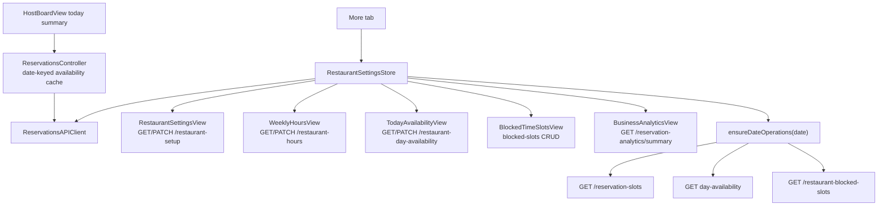

**What matters**
- Settings loads are **lazy** — do not block Host/Bookings/Guests tab switches.
- `ensureDateOperations` owns Task lifecycle (prevents stuck spinners on date change).
- `GET /reservation-slots` is **public** (no auth).
- Home availability indicator uses controller TTL/in-flight de-dupe, not local `@State` or `RestaurantSettingsStore`.

---

## 8. Admin / diagnostics flow

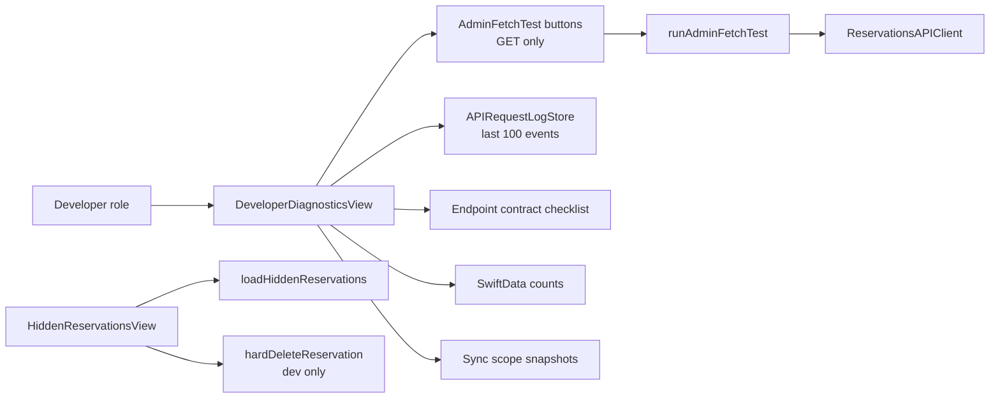

**Danger zone:** Diagnostics intentionally has **no automated mutation tests**. Confirm, cancel, create, block slots, and import must go through normal staff UI.

---

## 9. Guest Lookup / Call-In booking

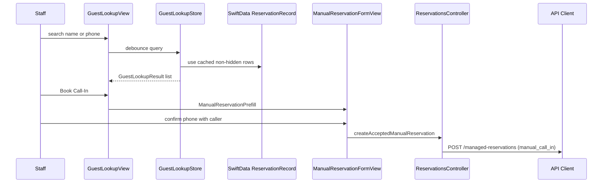

**What matters**
- V1 is call-in only; no Walk-In UI yet.
- No backend guest profile table exists. Lookup profiles are derived from the local reservation cache.
- Phone digits are the strongest identity key; email is secondary; name-only matches remain weak and are not aggressively merged.
- Search is local only. No API calls happen during typing, and the screen does not use Guest Insights / Regular Guests clustering.
- Prefilled manual create still uses server-first `POST /managed-reservations` and does not save locally until the backend returns a reservation.

---

## 10. Guest manage link & email direction

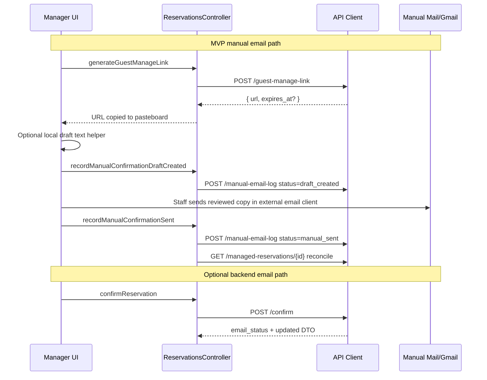

**Current direction (from code comments)**
- **Primary MVP for call-ins / no-auto-email:** Confirm Only (PATCH) + generate manage link + copy/open local draft + `manual-email-log`.
- **Manual sent:** `manual_sent` means staff reported sending through Mail/Gmail. Backend cannot prove inbox delivery.
- **Confirm + Email:** POST `/confirm` — backend/provider sends/attempts email; UI shows `emailStatus` notices when that fallback is enabled.
- Manual create: always confirmed, **no email**.
- Guest manage link and `draft_created` do **not** set `confirmationEmailSentAt`; `manual_sent` may set it on the backend.

**Guest self-service page**
- Public page title is “Your Booking Details.”
- Guest cancellation is allowed until 2 hours before reservation time, including same-day reservations more than 2 hours away.
- Less than 2 hours before reservation time, guest is instructed to call the restaurant.
- Guest change-request UI is hidden/removed from the MVP guest page.

---

## 11. SwiftData cache flow

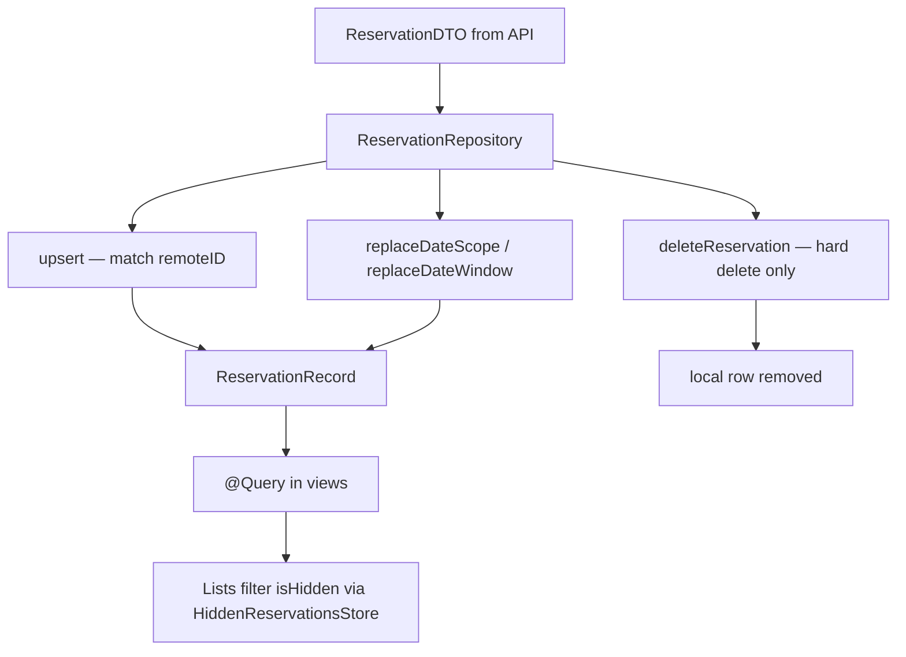

**Visibility rules**
- Normal lists exclude `isHidden == true` via `HiddenReservationsStore.isHidden`.
- Hidden rows preserved during replace sync when `includeHidden: false` (default).
- Review queue sync never deletes rows that left `new`/`needs_review` locally.

---

## 12. Backend integration map

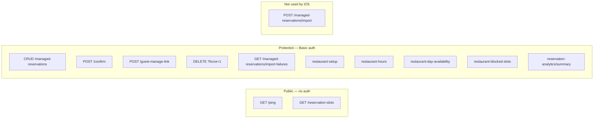

**API client defaults:** one in-flight request at a time, 15s request timeout, 30s resource timeout, GET retries capped at one retry for timeout/connection-lost, mutations no retry by default.

---

## 13. Current Architecture Audit

### Strong

- Backend remains the source of truth. SwiftData writes happen after successful GET/PATCH/POST/DELETE responses, not as optimistic truth.
- Native `TabView` owns Host / Bookings / Guests / More; the custom floating tab bar is deprecated.
- Home, Bookings upcoming, and Bookings Needs Review now share the active operational window cache.
- Active-window delta sync is correctly scoped with `from`, `to`, and `updated_since`; delta responses upsert only and never delete missing rows.
- Startup is cache-first: `ReservationsListView` renders immediately behind a minimum-duration launch overlay while network work runs in the background.
- Mutations are row/action scoped through `actionInProgressIDs`, `isCreatingReservation`, and reconcile IDs.
- Offline/degraded state is visible through notices and blocks create/edit/confirm/seat/complete/hide/restore/hard-delete/manage-link actions.
- API diagnostics are sanitized, reason-tagged, and include skip/fresh/in-flight decisions.
- NaN/layout safety helpers exist (`tryzubFiniteNonNegativeLayoutValue`, `tryzubSafeRatio`) and are used in major chart/geometry surfaces.

### Fragile

- `ReservationsController` still owns many concerns: reservation sync, restaurant setup cache, availability cache, mutation state, notices, diagnostics, and local seated timestamps.
- `server_time` cursors are in-memory only; app restart loses delta continuity.
- `performTodayRefresh`, `performScheduleWindowRefresh`, and `performReviewQueuesRefresh` remain as legacy/private paths. Current normal flow uses active-window refresh; future edits must avoid reactivating the old split paths.
- `loadScheduleAllPage` intentionally fetches broad history only in All mode. Any new Schedule search/filter code must keep `isActive && scope == .all` guards.
- `ReservationRepository.records(remoteIDs:)` fetches one descriptor per ID; acceptable for small pages but a batch predicate would be better for larger pages.
- More navigation now uses a typed path for top-level destinations and cancelled-row detail. Adding nested `NavigationStack(path:)` inside More children can reintroduce SwiftUI path type mismatch crashes.

### Over-complicated

- The reservation controller has both legacy flags and `ReservationOperationState`; they currently mirror each other rather than replacing old flags.
- Create/edit form state is shared, but slot loading, closed-day validation, and fallback defaults still live inside the form view.
- `RestaurantSettingsStore` is a store plus several embedded screens in one file; it is navigable but large.

### Performance and Memory Risks

| Area | Status | Risk | Recommendation |
| --- | --- | --- | --- |
| `RegularGuestsView` | Partly mitigated | Broad `@Query` still observes cached reservations, but clustering now runs through `RegularGuestsStore` instead of body computed properties. | Keep store caching; next improvement is snapshot/off-main analysis if cache grows further. |
| `GuestInsightsView` | Partly mitigated | Detail and Guest Insights compute reports into state keyed by selected row/cache freshness instead of body-time computed properties. | Keep reports lazy; next improvement is lightweight snapshots to avoid passing broad SwiftData arrays. |
| `GuestLookupView` | New lightweight path | Broad non-hidden cache query feeds `GuestLookupStore`, but search uses cached profiles and no O(n²) clustering. | Keep call-in lookup separate from Guest Insights / Regular Guests. |
| Guest-analysis screens | Confirmed | Cache-only does not mean cheap. Guest Memory and Guest Insights are intentionally lazy, but broad local analysis can still block navigation on large caches. | Treat any new guest-analysis work like analytics: precompute/cache reports, debounce search, and never run clustering from a SwiftUI body property. |
| Mounted tabs + `@Query` | Partly mitigated | Tabs stay mounted for navigation stability; each tab still observes SwiftData writes and may recompute local filters after upserts. | Keep active-window narrowed queries; consider controller-published counts for badges if cache grows. |
| Schedule All | Guarded | User-triggered All mode can still load many pages and upsert many rows; this is expected but can jank if used during service. | Keep All mode explicit; add page-level UI copy and avoid background loading more than one page. |
| Availability tasks | Mitigated | Controller stores per-date tasks; cancellation exists when Home hides, but task dictionaries must be cleaned on every path. | Keep current `defer`; audit after any new date operation task. |
| Launch loader | Low | Internal animation/message task; task is cancelled by view lifecycle. | No change unless previews show loops. |
| Charts/Geometry | Partly mitigated | Major chart math clamps finite values. Remaining Swift Charts domain generation should continue to guard empty/max-zero data. | Keep safe helpers mandatory for any new chart/GeometryReader math. |

### State Ownership

- Clean: API transport in `ReservationsAPIClient`; SwiftData writes in `ReservationRepository`; server mutations in `ReservationMutationService`; reservation workflows in `ReservationsController`.
- Still blurred: availability slot cache is in `ReservationsController`, while restaurant operations screens also have `RestaurantSettingsStore` caches; Add/Edit reads controller cache directly.
- Still blurred: manual email draft logic lives near detail UI. It is a safe boundary for the MVP, but should become its own service file before the full Gmail/Mail compose pass.

### Docs Corrected In This Audit

- Role selection is no longer hardcoded developer; manager/developer are selectable and persisted.
- Startup is active-window + setup, not today-only.
- Host/Bookings normal refresh is active-window cache-first, not separate schedule/review fetches.
- Home availability is controller-cached, not view-local direct API state.
- Failed Imports is manager-capable in UI as a sheet, not developer-only navigation.
- Request timeouts are 15s/30s with GET retry capped at one retry.

---

## 14. Next Refactor Plan

1. **Guest analysis snapshots:** Regular Guests and Guest Insights are now memoized, but still operate on SwiftData objects on the main actor. If cache grows further, copy lightweight snapshots and analyze off the UI path.
2. **Extract form slot state:** Add/Edit now blocks unverified/closed dates more safely, but slot loading and cached-slot selection still live in the form view. Move them into a small form view model before visual redesign.
3. **Split controller caches:** Extract restaurant setup/availability cache helpers from `ReservationsController` into a focused `AvailabilityOperationsStore` only if it reduces controller churn without changing routes.
4. **Retire legacy sync paths:** Remove or quarantine `performTodayRefresh`, `performScheduleWindowRefresh`, and `performReviewQueuesRefresh` after confirming no callers use them.
5. **Persist active-window cursor:** Store the active-window `server_time` cursor with a matching window key so app restart can delta sooner without using the device clock.
6. **Repository batch fetch:** Replace per-ID `records(remoteIDs:)` loops with a batched predicate helper when SwiftData predicate support is stable enough.
7. **Manual Gmail compose pass:** Keep backend email untouched; build a manual draft/compose UI around guest manage link generation and explicit staff confirmation.
8. **Staff role pilot:** Decide whether `.staff` should be selectable; if not, remove staff rows from pilot-facing docs or keep it as a future mode.

---

## 15. Known weak spots (document, do not fix in this pass)

| Area | Issue |
| --- | --- |
| Role | Role picker offers manager/developer only; `.staff` exists but is not selectable in current UI |
| Failed Imports | Manager can open the sheet; this is operationally powerful and should remain trained/admin-only |
| Home availability | Controller cache exists, but only today auto-loads; other dates load from Add/Edit/settings when requested |
| Guest Insights / Regulars | Cache-only and potentially heavy; broad `@Query` plus O(n²) clustering can block More on large caches |
| Cursors | Lost on app restart — first auto-refresh may full-replace |
| `createReservation` controller method | Exists but UI uses `createAcceptedManualReservation` only |
| Mutation progress | `actionInProgressIDs` disables affected row/actions; some sheets still need clearer button-level progress polish |
