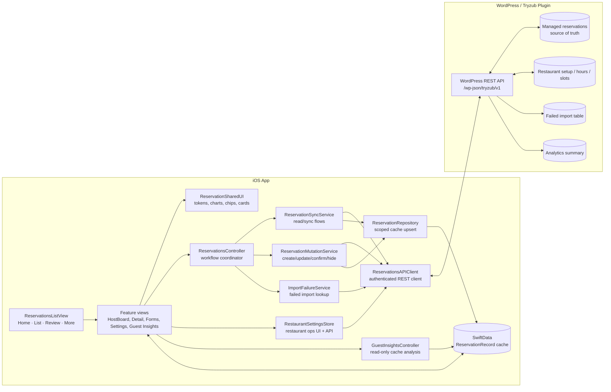
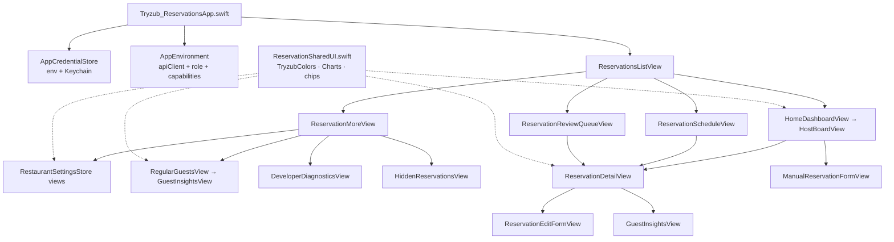
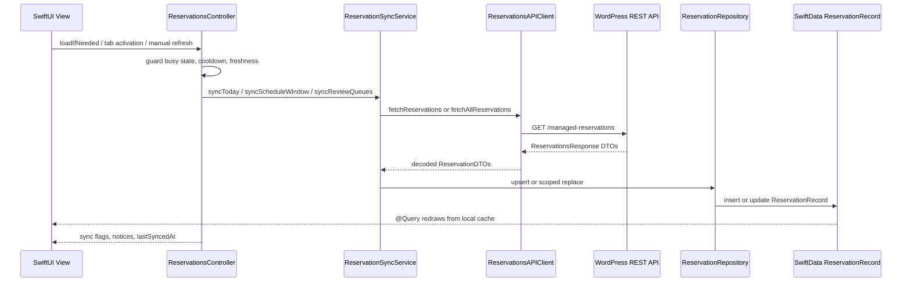
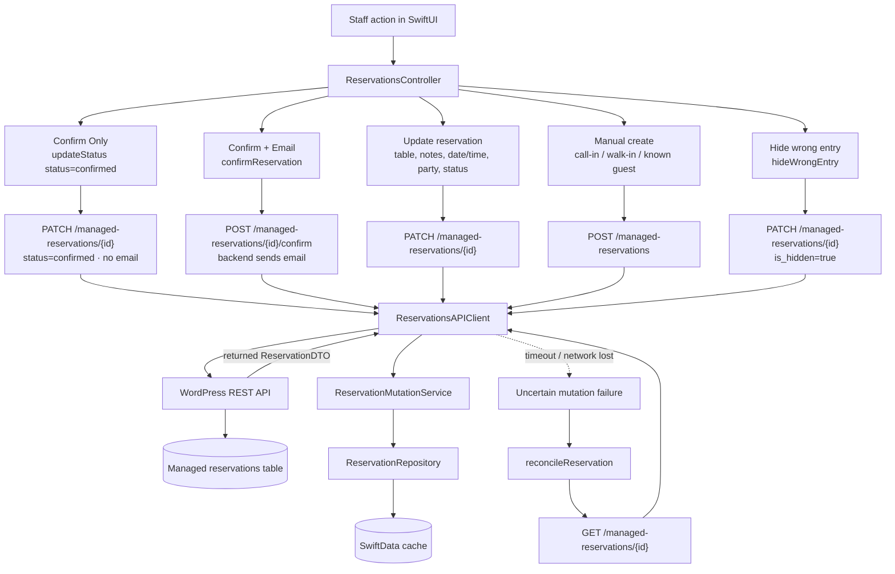
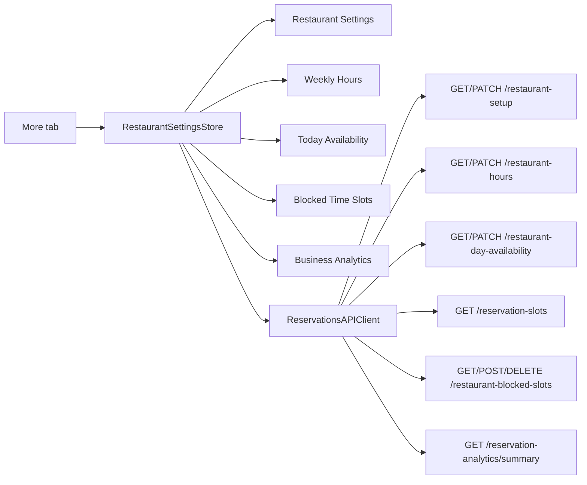
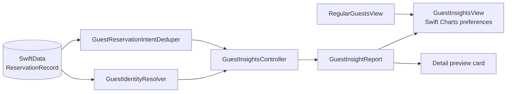
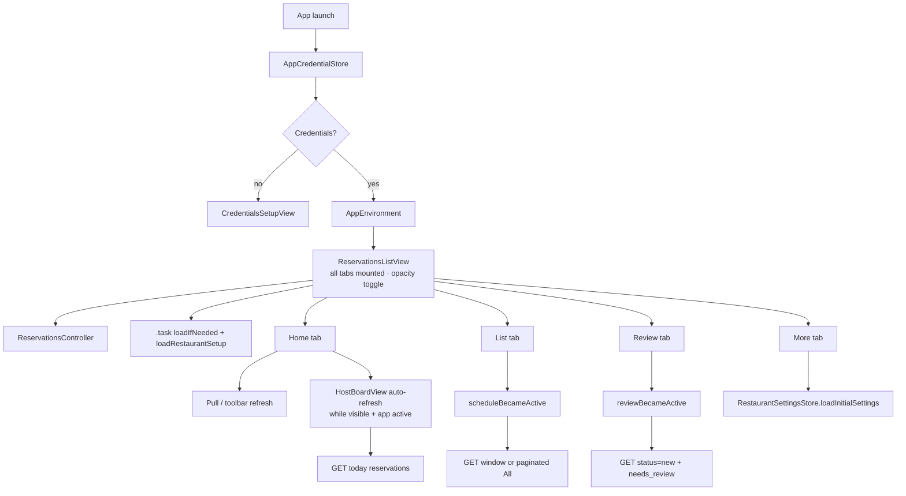
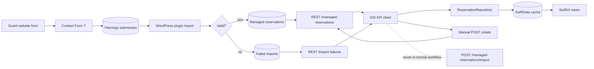

# Tryzub Reservations Architecture Diagrams

These diagrams describe the one-restaurant internal iOS app. The WordPress plugin REST API is the source of truth. SwiftData is a local cache only. The iOS app must not call `POST /managed-reservations/import` during normal workflow.

**REST base:** `https://tryzubchicago.com/wp-json/tryzub/v1`

---

## 1. High-Level Architecture

Notes:
- Views call **controller workflow methods** for reservations; they do not create API clients directly.
- **RestaurantSettingsStore** owns restaurant-operations screens (hours, availability, blocked slots, analytics) and talks to the same shared API client.
- **Guest Insights** reads SwiftData only — no network, no mutations.
- SwiftData is cache only. The backend managed reservations table remains truth.

---

## 2. App Module Layout

---

## 3. Fetch / Sync Flow

Notes:
- **Home/Today** fetches reservations for the selected service date.
- **List** syncs a 30-day window or paginated “All” mode.
- **Review** fetches `new` + `needs_review` queues (default **Pending** segment shows both, oldest submitted first).
- Failed network fetch leaves cached rows visible.

---

## 4. Mutation Flow

Notes:
- **Confirm Only** = PATCH `status=confirmed`. No email.
- **Confirm + Email** = POST `/managed-reservations/{id}/confirm` only.
- **Hide** = soft-hide via PATCH `is_hidden=true` (not hard delete).
- Manual create from Home often uses **`createAcceptedManualReservation`** (confirmed status, no email).

---

## 5. Restaurant Operations Flow

Notes:
- Settings store loads date-scoped data (availability, public slots, blocked slots) through **`ensureDateOperations`** so view re-computation does not cancel in-flight requests.
- Public **`GET /reservation-slots`** is unauthenticated; staff blocked-slot endpoints require auth.

---

## 6. Guest Insights Flow (Read-Only)

Notes:
- No API calls. No mutations.
- Matching uses phone, email, and name with confidence levels.
- Entry: **More → Guest Memory** or **Detail → Guest Insights**.

---

## 7. App Lifecycle / Screen Triggers

Notes:
- All four tabs stay mounted for fast switching (no NavigationStack rebuild lag).
- Home loads **restaurant setup** and **today availability/slots** for the stats card and service-load chart.
- Auto-refresh is guarded (not busy, no active interaction, cooldown passed).

---

## 8. Backend Data Flow

---

## 9. UI System (Shared Components)

| Layer | Location | Purpose |
| --- | --- | --- |
| Design tokens | `ReservationSharedUI.swift` | `TryzubColors`, `TryzubTypography`, `TryzubSpacing`, `ReservationLayout` |
| Cards / sections | `ReservationSharedUI`, `RestaurantSettingsStore` | `TryzubSectionCard`, `ReservationServiceCard`, `SettingsCard` |
| Reservation rows | `ReservationRowView.swift` | Context-aware rows (Home vs Review insight logic) |
| Charts | `ReservationSharedUI.swift` | `ServiceLoadChart` (Swift Charts), `ServiceTimelineGraph` |
| Actions | `ReservationActionButtons.swift` | Confirm Only / Confirm + Email / seat / table / hide |
| Forms | `ManualReservationFormView.swift` | Create + **ReservationEditFormView** with confirm dialogs |
| Tab bar | `ReservationFloatingTabBar.swift` | Floating nav + badge counts |

**Theme:** Black / white / gray operational palette; red reserved for warnings and destructive actions.
